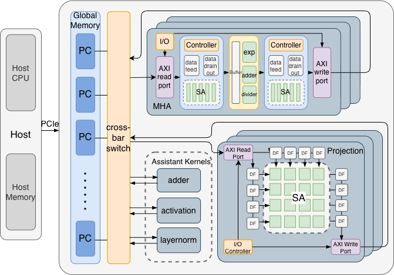

**Abstract:** As Transformer-based models become larger and more complex, the escalating computational and memory demands pose significant challenges to the design and optimization of Transformer accelerators. Existing accelerators have achieved many performance improvements through methods such as data flow optimization and novel pruning algorithms. However, the lack of comprehensive end-to-end optimization of the entire Transformer model from a hardware architecture perspective greatly limits the performance and hardware resource utilization of previous designs during deployment. The hardware architecture of existing accelerators greatly influences the performance and hardware resource utilization patterns of the accelerator. The existing works mainly adopt two styles of architectures for accelerators -- spatial and temporal architectures. However, neither of these two architectures can maximize hardware performance and both have significant drawbacks when accelerating the entire Transformer model. 

Therefore, we propose HyTrans, an end-to-end Transformer accelerator with a hybrid hardware architecture. HyTrans leverages novel hybrid architecture design, efficient module reuse, memory operation optimization, and software-level parallelism to combine the design advantages of both hardware architectures while overcoming their shortcomings, effectively improving the accelerator's latency and throughput. Moreover, HyTrans balances resource utilization and allocation among different modules, globally optimizing the hardware resource utilization of the accelerator.

We also implemented a highly flexible, scalable, and easily modifiable HyTrans accelerator framework using high-level synthesis (HLS), providing guidance and insights for future researchers to design accelerators with better hardware performance. To validate the performance improvements and hardware utilization efficiency of HyTrans, we tested our design on an Alveo U280 FPGA board. Evaluation shows that HyTrans can achieve 1.5-3.8x speedup in inference compared to state-of-the-art accelerators and up to 18.7x better energy efficiency over GPU and previous works.